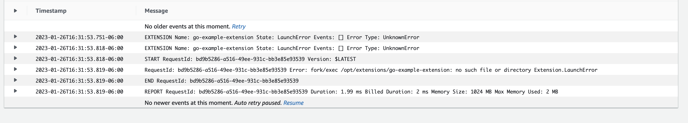

# AWS Lambda Docker Go Extension

This sample app is attempting to combine a go lambda extension built and published to ECR with a container lambda function.

However I am running into the following issue after deploy 👇

See the sub-folders for how to build the lambda extension and the dockerized lambda function.
